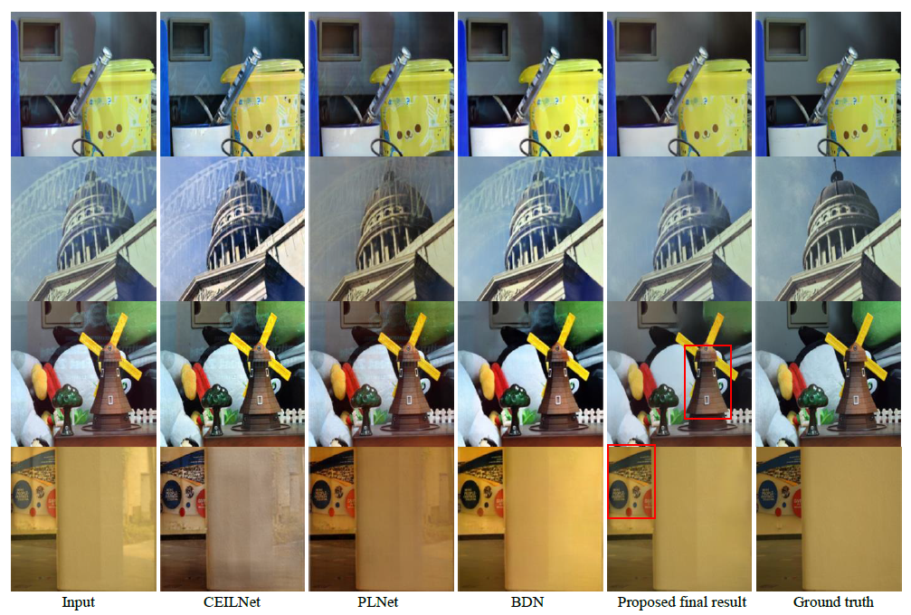

# RM2S
### "Single-Image Reflection Removal via a Two-Stage Background Recovery Process"


### The code is implemented on pytorch>=0.2.1

### How to use
#### Training:
- Training process uses images from [VOC2012](http://host.robots.ox.ac.uk/pascal/VOC/voc2012/)
- The network for the first stage process: 
```
python train_1st_stage.py --imgs_dir your_voc12_path/VOC2012/JPEGImages/
```
- The network for the 2nd stage process: 
```
python train_2nd_stage.py --imgs_dir your_voc12_path/VOC2012/JPEGImages/
```
####Testing:
- Pre-trained models [download](https://connectpolyu-my.sharepoint.com/:f:/g/personal/15900416r_connect_polyu_hk/EoqNZf4wnPxHhwKlVtd0XTcBNY-74SgvI4cvG8DUpSiTeQ?e=BpTNcH)
- Test your single image:
```
python one_img_demo.py --img_dir one_image_path(i.e. imgs/1.png) --net_ini_pkl path_to_trained_models/Net_1st_stage.pkl --netG_img_pkl path_to_trained_models/Net_2nd_stage.pkl
```
- Test on [SIR2 benchmark](http://rose1.ntu.edu.sg/Datasets/sir2Benchmark.asp):
```
python benchmark_imgs_process.py --bechmark_dir SIR2_dataset_path --net_ini_pkl path_to_trained_models/Net_1st_stage.pkl --netG_img_pkl path_to_trained_models/Net_2nd_stage.pkl
```

## Citation
```
@Article{li2019rm2s,
  author    = {Li, Tingtian and Lun, P.K. Daniel},
  title     = {Single-Image Reflection Removal via a Two-Stage Background Recovery Process},
  journal   = {IEEE Signal Processing Letters},
  year      = {2019},
}
```
